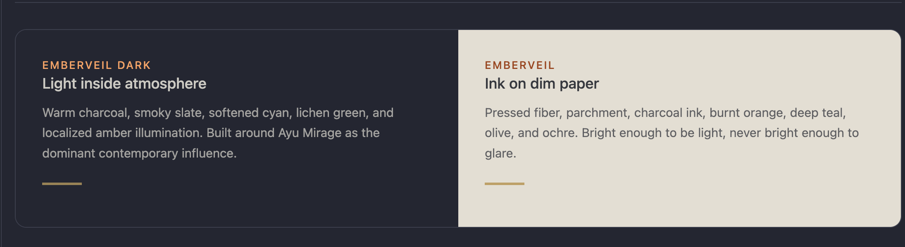
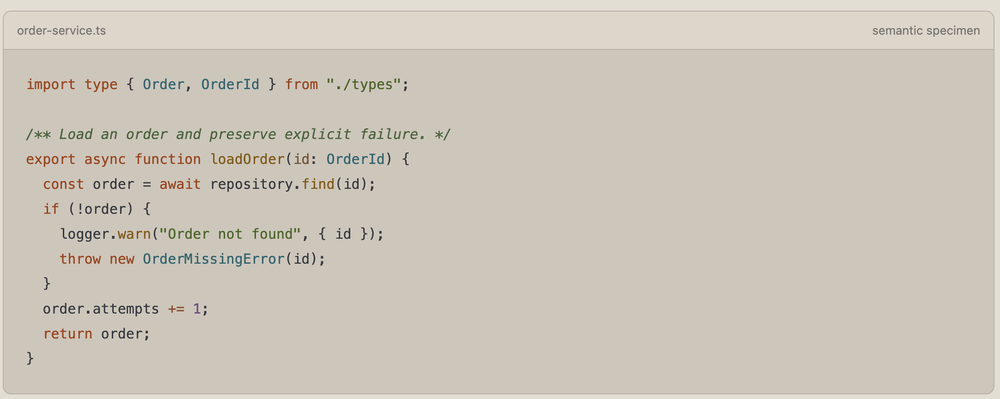
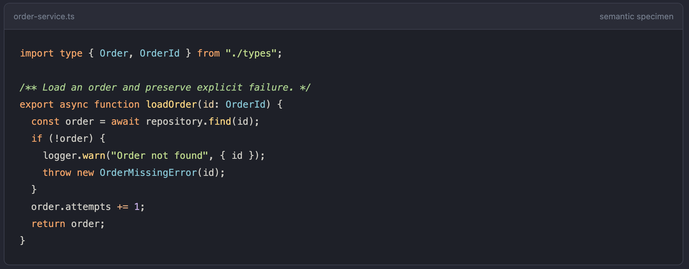

<p align="center">
  
</p>

<h1 align="center">Emberveil</h1>

<p align="center">
  A warm, low-fatigue cross-application theme family for focused work.
</p>

<p align="center">
  
</p>

<p align="center">
  
</p>

# Emberveil Theme

Emberveil is a personal cross-application theme family built around comfortable contrast, warm semantic color, and surfaces designed for prolonged use.

The repository contains the primary Emberveil family and two earlier theme explorations that remain as design references.

## Core Emberveil family

- **Emberveil design system** - the canonical, self-theming family reference for identity, semantic colors, syntax, components, accessibility, and implementation. [Open design system](emberveil/emberveil-design-system.html)
- **Emberveil** - the regular paper-light theme, using dim paper surfaces instead of bright white. [Preview](emberveil/previews/emberveil.html) · [Specification](emberveil/specs/emberveil.md)
- **Emberveil Dark** - the Ayu Mirage-led dark companion. [Preview](emberveil/previews/emberveil-dark.html) · [Specification](emberveil/specs/emberveil-dark.md)

## Try it in VS Code

The installable VS Code extension contains both core themes. Download or open the latest build, [`vscode/dist/emberveil-theme-0.1.3.vsix`](vscode/dist/emberveil-theme-0.1.3.vsix), then:

1. Open the Command Palette in VS Code.
2. Run **Extensions: Install from VSIX...** and select the file.
3. Run **Preferences: Color Theme**.
4. Choose **Emberveil** or **Emberveil Dark**.

The implementation covers workbench chrome, editor and selection states, TextMate syntax scopes, semantic tokens, terminal ANSI colors, Git and diff states, diagnostics, notebooks, and testing UI. See the [VS Code extension notes](vscode/README.md) for local development and validation.

Deferred visual-audit findings are preserved in [VS Code deferred refinements](emberveil/notes/vscode-review-deferred-refinements.md).

## Try it in Zed

The native Zed extension in [`zed/`](zed/) installs both **Emberveil** and **Emberveil Dark** as one theme family. In Zed's Extensions page, choose **Install Dev Extension** and select the `zed` directory. Then open the theme selector and choose either family member.

The implementation maps the full surface hierarchy, editor states, diagnostics, Git states, terminal ANSI palette, collaboration colors, and Zed semantic syntax roles. See the [Zed extension guide](zed/README.md) for automatic light/dark switching and validation.

## Try it in Zen Browser

The native Zen Mod in [`zen/`](zen/) brings both Emberveil appearances to Zen's browser interface while preserving Zen's own layout. It covers tabs, Essentials, folders, workspaces, the URL bar, autocomplete, menus, extension panels, downloads, side panels, the find bar, Glance, notifications, and private windows. See the [Zen Mod guide](zen/README.md) for local testing and appearance preferences.

## Try it in Ghostty

The native color-only themes in [`ghostty/`](ghostty/) provide paired **Emberveil Dark** and **Emberveil Light** terminal palettes for Ghostty, including cursor, selection, and all 16 ANSI colors. They can follow the operating-system appearance automatically and deliberately leave typography, opacity, layout, and terminal behavior alone. See the [Ghostty theme guide](ghostty/README.md) for installation and validation.

## Try it in RAD Studio 12.3

The editor-only package in [`rad-studio/`](rad-studio/) installs **Emberveil Dark** and **Emberveil Light** as named Code Editor Color SpeedSettings for RAD Studio 12.3 Athens. It deliberately leaves the IDE theme, VCL styling, designers, panels, and layout unchanged. See the [RAD Studio editor-theme guide](rad-studio/README.md) for backup, installation, selection, and removal.

## Try it in Database Workbench 5 Pro

The editor-only package in [`database-workbench-5/`](database-workbench-5/) installs **Emberveil Dark** and **Emberveil Light** as native Database Workbench 5 Pro color-scheme files. It maps the Emberveil syntax language and editor-state surfaces that DBW5 exposes while leaving the surrounding application UI unchanged. See the [Database Workbench 5 guide](database-workbench-5/README.md) for installation, removal, and limitations.

## Ideas and inspirations

- **Aurora Forge** - a more energetic synthesis of Ayu Mirage, Nord, Cobalt2, JetBrains/Darcula, and personal preferences. [Preview](ideas/aurora-forge/preview.html) · [Specification](ideas/aurora-forge/spec.md)
- **Vermilion Fjord** - a restrained charcoal concept derived from a manually configured Delphi environment. [Preview](ideas/vermilion-fjord/preview.html) · [Specification](ideas/vermilion-fjord/spec.md)

## Repository structure

```text
emberveil/
  emberveil-design-system.html  Canonical family design and implementation reference
  previews/    Browser-ready Emberveil prototypes
  specs/       Core family design specifications
vscode/
  themes/      Installable VS Code theme definitions
  dist/        Ready-to-install VSIX package
zed/
  themes/      Native Zed theme family containing both appearances
  scripts/     Structural and schema-aware validation
zen/
  chrome.css   Native Zen Mod browser-chrome styling
  preferences.json  System, dark, and light appearance controls
ghostty/
  themes/      Paired native Ghostty color themes
  scripts/     Canonical palette generation and native validation
rad-studio/
  12.3/editor/  Importable editor-only registry themes for BDS 23.0
  scripts/      Deterministic registry-theme generator and validation
database-workbench-5/
  themes/      Native Emberveil editor color schemes for DBW5 Pro
  install.ps1  Installs both schemes into the DBW5 Pro data folder
  uninstall.ps1  Removes only the two Emberveil scheme files
ideas/
  aurora-forge/
  vermilion-fjord/
```

## Current status

Emberveil is the active direction. The files under `ideas/` preserve useful experiments and inspiration, but they are not part of the primary theme family. Emberveil and Emberveil Dark are packaged for VS Code, Zed, Zen Browser, Ghostty, RAD Studio 12.3, and the Database Workbench 5 Pro code editor; implementations for other applications and a production design-token library remain future work.
